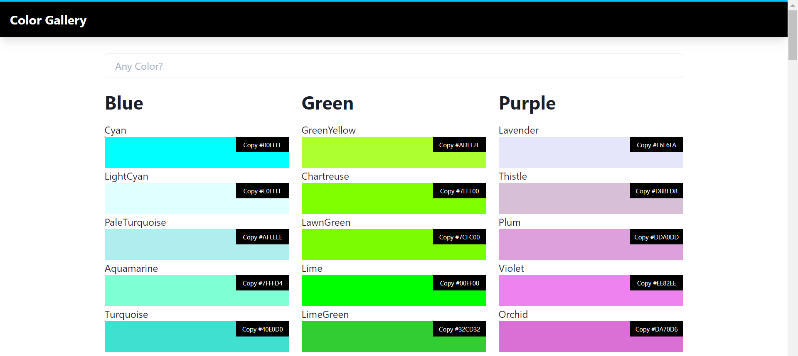

# React-Pokemon

This application generate random color and filtered by "category".

## Preview


## Build Setup

``` bash
# install Node Module dependencies
npm install

# serve with hot reload at localhost:3000
npm start

# build for production with minification
npm build
```

## Technologies
This project uses several technologies listed below :

- **[React Typescript](https://www.typescriptlang.org/docs/handbook/react.html)**, is extends JavaScript by adding types
- **[React Router](https://reactrouter.com/)**, is a collection of navigational components that compose declaratively with your application
- **[Chakra UI](https://chakra-ui.com/)**, simple, modular and accessible UI components for react applications. based on [Emotion](https://emotion.sh/docs/introduction)

